<head>

</head>

<!-- Main -->

<!-- One -->
<section id="one">
	

		<header class="major">
			<h1>Memorials</h1>
		</header>

<!-- Taylor Lab Members -->
<h2 id="content">Taylor Lab Members</h2>

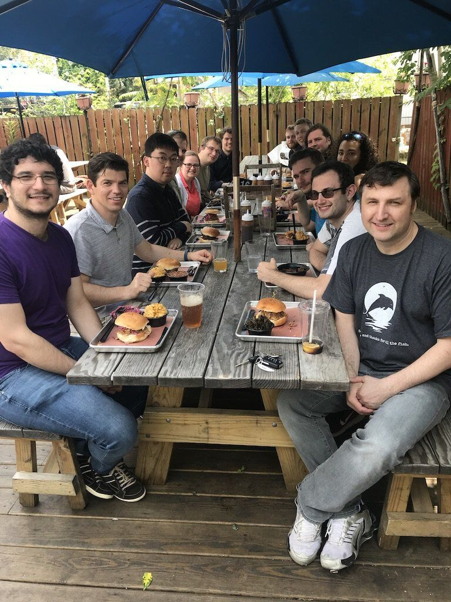

 	
James Taylor was such a vital and energetic force, I am still at a complete loss for words for this unthinkable tragedy. James and I have known each other for more than a decade, as mentor, boss, colleague, and friend. In the beginning, we decided to take a chance on each other, me as his first student, he as my advisor. I have never looked back. James was an inspiring person, showing you the breadcrumbs leading down an interesting path, and then watching you follow them with encouragement and confidence to a place neither of you had been before. I think one of his most amazing traits was to maintain his sense of wonder and excitement well past when most of us begin to lose it. The outpouring of love and support in the wake of this show just how many people he has inspired and helped with his boundless enthusiasm and vision.

	
But more than losing an amazing boss and scientific juggernaut, I am going to miss the James that many fewer people got to see or know. There were special moments, on a long ride to a conference, chatting over a beer, or sometimes in the most unexpected situations when "Science James" would slip away and playful geek would come out on full display, whether discussing comic books, the singularity, Doctor Who, music, books, and anything else in his extensive catalog of personal interests. He always felt like the coolest and nicest person that you wanted nothing more than to please and be liked by.

	
The graduate students at his first professorship nicknamed him 'the rock star'. I don't know if they ever realized how accurate and far from the truth at the same time this was. If anyone had an amazing sense of style and presence, from the shoes up, it was James. But he was also a humble and soft-spoke person, never looking to steal the spotlight or dominate. Instead, he was an advocate, both for those he personally worked with, and for all of the scientific community, pushing for honesty, fairness, transparency, responsibility, accessibility, and reproducibility.

	
While his loss is a wound that may never heal, I am immeasurably enriched for having known, learned from, worked with, and shared so much of my life with James. Thank you for everything.

	
<b>—Michael Sauria</b>

	
Rest in peace. I will always remember you.

	<b>—Min Hyung Cho</b>

	
Even before I joined his lab, I looked up to James. I saw him and his lab members as pinnacles of unattainable success that I did not even dare to dream of. Beyond his professional success, James’ charisma and subtlety had an enchanting effect on everyone who interacted with him. While very few of us truly knew him well, everyone in the department talked about him as if he was the hottest celebrity in town. In any conversation or meeting James would always say the least, but the few words he did say were so on-point that everyone intently listened in on everything he had to say.

	
After I joined his lab, James turned out to be exactly the opposite of what one might expect from a P.I. of his position - he was incredibly patient, laid back, and always easy going. From the beginning, the vibe I got from James was that he thought I did not need his help because he believed I could already do great things. While admittedly this was sometimes a source of frustration, his hands-off style somehow only inspired everyone in his lab to achieve that greatness. It was this strange and unique “James Taylor” mentoring style that distinguished his lab from the department. Despite no explicit expectations and deadlines, I worked my butt off just to prove to myself and James that he made the right choice by taking me into his lab. This resulted in the strangest and most amazing work environment I’ve ever seen. On one hand, we played video games in the meeting room during work hours, watched movies, played D&D, and flew drones around the lab – I think many outsiders probably thought that’s all we did. And yet when it came to science, the lab was <b><i>on</i></b> – everyone worked their hardest to deliver their A-game. I believe that this was James’ greatest achievement as a mentor and leader – he created an environment people were truly happy to be in, populated it with people he believed in, and then <b><i>trusted</i> </b>them to be the best. To create this kind of environment in any workspace, let alone Johns Hopkins, was just remarkable. I feel incredibly fortunate to have been a part part of it.

	
James Taylor and the magic that he brought to the entire department can never be replaced. He was an integral part to my life at Johns Hopkins and I will miss him dearly. The last email I got from him, just a few days before his passing, was my thesis defense form with his signature on it. Somehow I think of it as one last blessing from him, telling me to take what I learned from him and achieve greatness just as he had. I am devastated that can’t go back and visit him to tell him how I am doing, and to show him that he was correct to believe in me. I can only move forward, continuing to prove to myself that he made the right choice. To make him proud.

	<b>—Gherman Uritskiy</b>

	
I’ve written about four of these tribute responses to James so far and I’m still struggling to find the right words. James was brilliant, kind, magnanimous, and supportive, and a great force for good in academia and the world.

	
As I continue my work I keep thinking “I should send this result to James,” and “I wonder if James has any ideas on how to solve this problem” and then reality comes crashing back in. It’s still hard for me to believe. It is cruel and unjust that he was taken from us so soon.

	
James gave me a chance in his lab when I was at my lowest point of graduate school, he believed in me even when I didn’t believe in myself. As I transitioned into his lab, James was unbelievably patient, and the lab environment he fostered was so welcoming. His leadership was understated and incredibly effective, both at generating results and at creating an environment where people would work hard because they were given the freedom to find problems that they were interested in and the support to tackle them head on.

	
I’m so grateful to James and his lab for everything. Thank you James.

	<b>—Nathan Roach</b>

	
Many people know James as an advocate for transparency, and Galaxy as his way of trying to make it easy for people to be honest and clear about the work that they have done. The thing that I admired the most about James is that he paired this quality with a willingness to entertain crazy ideas. Being both a proponent of strict rigor but also willing to support a project that isn't risk free and would take years to yield fruit made him one of the best scientists I ever worked with, and and will ever work with. He carved out a place in the department to be weird. Thank you, and rest in peace.

	<b>—Boris Brenerman</b>

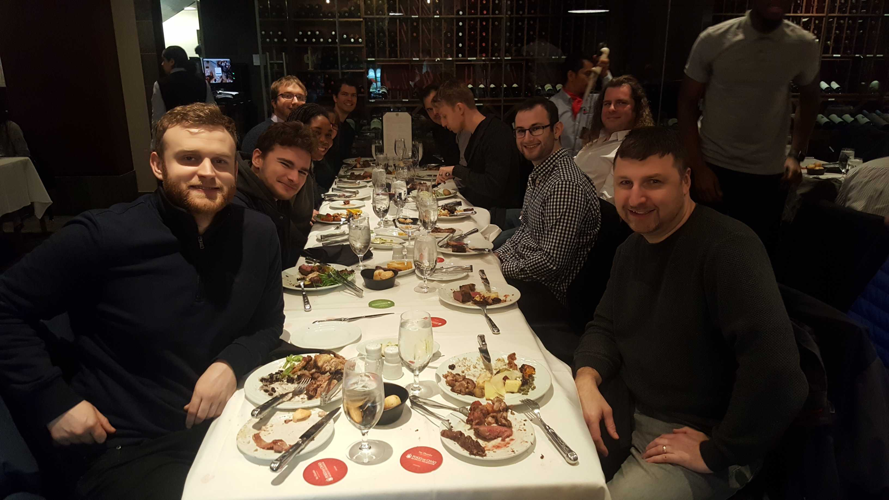

<!-- Faculty -->
<h2 id="content">Faculty</h2>

	
James was a cornerstone of the department and of the scientific community. But most of all he was the exemplar of a colleague and just a
wonderful human being.

	<b>—Vince Hilser</b>

	
It’s funny that a self-described introvert like James would be so famous for wearing loud and colorful – even sparkly – sneakers! That might be the only enigmatic thing about him though; otherwise, he was very much a ‘what you see is what you get’ sort of person. Completely genuine, deeply discerning, ready to devote whatever time and energy needed to help colleagues, always happy to share food and drink and conversation. May we all follow suit to be our authentic selves and to share that with others.

	
Our department often talks about the big move it was for us to hire James – he was, after all, our first purely computational biologist with *gasp* NO WET LAB. Well, it was a big move for us, and in my opinion, one of the smartest moves our department ever made. And all of the other tributes here no doubt back that up. What I am now reflecting on is what a big move it must have been for James. He had to trust that we were sincere in our desire to build in his area of research and that our promises to help him catalyze broader efforts both within and beyond our department were sincere. He had to trust himself that he could enter this potentially skeptical environment and demonstrate the value he could bring to our community. There is no doubt that happened, with far more impact and success than even the most optimistic among us could have hoped for. May we all be inspired by the many wonderful qualities of James as a scientist and colleague, and do our best to embody those qualities in all we do.

	
As hard as it is for all of us as friends and co-workers and colleagues to accept that James is no longer here with us, this is hardest of all for Meredith. James and Meredith absolutely adored each other, and that is so evident to anyone fortunate enough to have shared an evening with them. May we all take inspiration from the love they shared; let us love one another and always be here for Meredith.

	<b>—Beverly Wendland</b>

	
James Taylor was a true scientific trailblazer in the Department of Biology. He single-handedly brought computational biology to the forefront of the department, enlightening our students and faculty to new ways of analyzing data. Since his arrival, other like-minded computational and quantitative scientists have joined our department, growing the seed that James had started. James’s impact reached far beyond science as he brought a true sense of collegiality, always available to collaborate and help to tackle a scientific challenge.

	
James and his lab were the best collaborators that I’ve ever had. Available and interested at a moment’s notice, James always wanted to be part of the scientific adventure. James worked with our group to analyze gene expression, characterize transcription factor binding sites, identify natural variants and associate them with phenotypes, sequence genomes, and determine genome organization in the nucleus. James always cited his mentors’ advice that the goal of an excellent computational biologist is to be the best middle author. James achieved this goal, time and time again. He truly helped the Johnston lab achieve more than I ever could have imagined and I am eternally grateful.

	
Beyond being a tremendous scientist and collaborator, James was a true friend. James, the cool, chill, long-haired computational scientist was the yin to my hyper, anxious, balding biology yang. His door was always open to listen to my worries as a pre-tenure professor. He was truly giving and supportive. For every paper and every grant, he sincerely congratulated me with a big smile. He talked about how special it was that we were all a part of this amazing department, that was uniquely supportive in the very competitive world of science. Beyond scientific chats, James was always up for a fun, nerdy debate about superheroes, punk rock music, or video games. James was an amazing colleague, scientist, and friend. I love him like a brother and I miss him very much.

	<b>—Robert J. Johnston</b>

	
James was incredibly talented, and very generous with assisting others. I know my lab and I benefited greatly from his help. His faith in me, and especially my student Jeremiah, emboldened us to pursue exciting work we would not have pursued without his encouragement. The impact of James's support and guidance on me and my students is incalculable.

	
I had less to offer in return, but to thank him for his kind generosity, I made sure to give him choice roles in the annual CMDB faculty skit. When I first cast him in a Game of Thrones role, I mentioned he was in good shape, and jokingly asked if he would be willing to perform shirtless. He politely declined, so I decided to try again, and asked if he would be willing to AT LEAST perform sleeveless. Despite his shy tendencies, James agreed, so I made sure to cast him in sleeveless roles in future performances. While his thespian skills were perhaps slightly less refined than his amazing computational abilities, James was always willing to give a sleeveless 110% effort, which was appreciated by both myself, and the students.

	
I regret I will not be able to cast him in future roles as sleeveless action stars and super heroes, but more importantly, I will regret not having him here with us on this planet. James really didn’t need me to make him into a fictional super-star. He was one in real life, and he will be missed.

	<b>—Andrew Gordus</b>

	
As a department, we struggle to make sense of this tragic loss in a surreal world right now. We will miss you, James. You were a wise, kind and generous colleague, and good mentor to your students.

	<b>—Rejji Kuruvilla</b>

	
Some lead from above, but the best leaders lead from within by lifting up everyone around them into a strong community. I will miss you dearly my friend and leader James.

	<b>—Michael Schatz</b>

	
I am so sad for this loss of my mentor, colleague, and friend. James is one of the main reasons that I came to Hopkins in 2018, as well as one of the main reasons that the experience has been so positive.

	
Through his efforts in our department, James demonstrated the relevance and value of quantitative and computational research to all areas of biology. He dedicated his life’s work to developing tools and platforms to make computational genomic research more accessible, reliable, and robust—challenging gatekeeping in all its forms.

	
As my faculty advisor, James’s calming demeanor was essential to navigating the imposter-syndrome-inducing experience of launching a new lab. Beyond any specific pieces of guidance or feedback, James gave me confidence based on the knowledge that someone I respected so much believed in me and had my back.

	
This is a huge loss on multiple levels, which we will feel for years to come. I am meanwhile encouraged by the fact that the community he built and principles for which he advocated are here to stay.

	<b>—Rajiv McCoy</b>

	
“Mesa James James Binks. Isa invented Galaxy software. The key to the bioinformaticsa universa!”

	
Above is a line recited by James from the Star Wars themed faculty skit written and directed by Bob Johnston and performed altogether at the 2016 retreat. Despite his seemingly shy nature, James acted so professionally. We laughed and giggled, all throughout the practice dressed up in awkward costumes and the actual performance was a big hit. It’s one of my now achingly fond memories of James. I only wish I was given another chance to act with James, to share and build the fun memories together.

	
James organized the quantitative biophysics course for CMDB grad students starting 2019. The course involved five different instructors who weren’t quite sure what needed to be taught. James contributed the most lectures into the course while running all the Friday lab modules with the TAs. Even up to March 28th of this year, he emailed all the instructors, kindly guiding us on how to slack message the students and how to prepare for zoom lectures etc.

	
James was a calm presence… like a steadily positioned star in Galaxy. His stellar science will remain with us and instruct us on the myriad of ways of analyzing genomic sequences. I miss him and regret not interacting him more.

	<b>—Sua Myong</b>

	
In Appreciation of James Taylor

	
My office was a few doors down from James’ office, and it is hard to imagine not running in to him anymore.  James brought contemporary genomics into the Biology Department, forging a crucial, new scientific direction. We had started to build a relationship based on shared interests in the epigenome, talking about the NIH 4D nucleome program, and exploring ways to collaborate on genome-wide transcription factor interactions. I greatly appreciated James’ insights and his open approach to science, and particularly his desire to be embedded next to colleagues on the experimental side for dialogue and collaboration.

	
To lose a young colleague at the height of his career is very hard to accept. I saw James as a key part of our department’s future and so admired and appreciated his scholarship. And that includes his ‘cool dude’ persona. James’ impact on our science and our students is indelible, his spirit remains vivid in our minds, and we will honor him by continuing to build on his legacy and the kind of biology he envisioned for the coming generation of students and colleagues.

	<b>—Carl Wu</b>

	
I shared the floor with James for the past 3.5 years. My encounters with him were brief, but always involved an exchange of smiles, which somehow assured me that I'm doing okay. I admired his scientific achievements, no-nonsense attitude, and fashion sense. I still cannot believe that he is gone.

	<b>—Yumi Kim</b>

	
It is extremely difficult to accept that James is gone. James and I joined the Biology department around the same time. It has been amazing get to know him and to see how quickly he became such a towering presence in the department through his genuineness, dedication and generosity. I will miss him very much as a scientist to look up to, as a thoughtful voice, as my unofficial retreat skit partner, and as James Taylor.

	<b>—Christian Kaiser</b>

	
My lab discovered Galaxy years ago, before I knew who had invented it.  It was fantastic-we could analyze our Genomics and RNAseq data without needing to write code or find a bioinformaticist to help out.  I later heard about James through Victor Corces, who had hired him at Emory and collaborated with him on 3D chromatin analysis. Later yet, I was on a biology Genomics faculty search committee, which eventually resulted in hiring James, poaching him away from Emory.  I had wanted the department to hire a Genomicist for a long time, and James was a fantastic choice.  Suddenly, all of our graduate students could get training in Bioinformatics, starting with a Boot Camp when they first arrived.

	
My lab collaborated with James’ lab on study of a long non-coding RNA, TAPAS, we had discovered in the TERT promoter.  Through analysis of the cancer genetic atlas, a surprising discovery was that either TERT or TAPAS was expressed in most primary tumors;  rarely, they were both expressed.  Additional data suggested that TAPAS negatively regulates TERT.  This work was published in Non-coding RNA  in early 2018 (Malhotra et al.).  I remember it was sometimes hard to find James to discuss the data-I heard that he used to hang out at the Zoo.

	
More recently, we were collaborating on an extension of this work, looking at the 3D architecture of the TERT gene and planning to co-mentor a new graduate student.  His untimely death was a huge shock and I am greatly saddened by it.

	
James was very generous with his abundant knowledge-he gave a guest lecture in my graduate seminar class on RNA this past February.  He was in his element, answering students’ questions and pushing for reproducibility.  The class honored him with a moment of silence (on Zoom) after his death.

	
James was inspiring and he was fun, amazingly creative and a big thinker. His creation, Galaxy, was truly a gift to science, allowing novices into the world of Genomics. He was a fabulous addition to the department and to the field. I am happy that I had a chance to collaborate with him-although it was too short.  He will be greatly missed.

	<b>—Karen Beemon</b>

	
I still can not believe that James is no longer with us. I have been used to the thinking that whenever we have any bioinformatics problems that need a second expert opinion, all we need to do is to walk ~5' to talk to James. We have discussed with James about writing collaborative grants. Although we have not acted on it, we took comfort in that James would always be there to support this effort once we get around to it. I am not sure it is possible to fill the void James left behind in our scientific community because of his generosity in sharing...

	<b>—Yixian Zheng</b>

	
In so many ways, James was transformative. He will be remembered for the huge variety and depth of his accomplishments. And also for his stylish shoes.

	
Thank you James for inspiring us.

	<b>—Kyle Cunningham</b>

	
There are so many thoughts and moments that come to mind when I think about James. These largely centered around the student and faculty committees that we served on together.  For starters, we seemed to share many of the same perspectives - James liked to quantify what made sense to quantify.  James never lost the belief that we can make things better no matter how frustrating the current state of affairs might be. I remember one time we were in a student exam together and James felt a faculty member was acting unfairly.  He not only spoke up, we had a serious text exchange about ideas we would put forward to change the system for the better. To that end, I have to share one other story:

	
Prior to James being on the CMDB Admissions committee, we used to manually schedule faculty interviews (each faculty interviews 5 applicants, there are usually 45 applicants... so we often scheduled like 225 interviews).  This is so complex for many reasons one being that faculty all had complex schedules, applicants sometimes specifically request specific faculty they want to meet, all applicants need to meet with at least 1 admissions committee member.....So in comes James to this meeting where we manually used index cards with applicant names and paper schedules with faculty availability all splayed out on a big table to schedule the interviews.   When we finished, over 4 h later, James looked at me and and said, "I will never do that again" and walked off.  The next year came around and James came to me with a program... we called it the "the sorting hat" that did the entire task. I am not sure if James was a Potter fan or who came up with that name but it stuck and we used it.  Each year making improvements. After this year's interview day, we even talked about sorting hat v3.0 and and how we were going to make it even better.  I will miss him dearly.

	<b>—Steve Farber</b>

	
The legacy of James research contributions and the unprecedented magnitude of his transforming impact in our department, especially considering the short time we were privileged to have him as a colleague, cannot be matched by most of us with many years of service. This was unquestionably admirable.  But, what impressed me most, and is something I will never forget, was his unassuming, gentle participation in our daily affairs. His soft-spoken manner, which was sometimes conveyed as an illusion of shyness, comfortably overshadowed the towering magnitude of his creativity and vision and James’ eagerness to share his ideas with all. In the last few months, James and I were exploring the possibility of starting a collaboration emanating from an idea I had about developing a novel recipe of sample preparation of eukaryotic nuclei for use in Hi-C analyses of the 3-D genome organization with the aim of improving the physical limits of resolution of this methodology. Our discussions exemplify what I think was his greatest attribute: James’ mission of collaborative science was one that brought people together as colleagues, not just in our department, but throughout the scientific community. I will miss him dearly.

	<b>—Van Moudrianakis</b>

	
Memories of working with James:

	
My most vivid memories of working with James go back two years, when he and I co-chaired our Genetics & Genomics Faculty Search Committee. That moment, we did a high-five in the hallway to celebrate that our top job candidate, our newest recruit Rajiv, had accepted our offer! James is so much fun and always an easy and lighthearted person to work with. He was so resourceful and very humble. He also had this “hidden” sense of humor that always brought up laughter at countless dinners! It has truly been an honor to have worked with James and these moments will always be held as valuable memories.

	<b>—Xin Chen</b>

	
James and I shared adjoining offices and labs in the new UTL building.  For the past five years, we had grown very close as colleagues with common scientific interests, but more importantly as friends.  We talked often in each other’s office about scientific ideas and specific projects, as well as the hopes and plans for our labs, our students, and the department.  There is a predictable cadence to daily life when you work next to someone for that long and James’ way of working, with feet kicked up, coding on his laptop, was always a comforting sight for me.  His zen-like aura made me feel as though I could carry on with my own work having the reassurance that I could poke my head in his office any time to shoot the breeze.  And sometimes, at the end of a particularly intense week, he would stop by, usually at my behest, plop himself on my office couch, and we would have a drink together.  Unfailingly, it seems, other colleagues would stop by and we’d all just unwind and decompress and laugh.  I will miss that camaraderie and the sense of a shared mission and feel unmoored without him next door.

	
James was such a passionate advocate for collaborative research.   We co-mentored a very talented student, Nathan Roach, and we recently celebrated the publication of Nathan’s terrific paper. It was the first of what we imagined would be a long series of projects over the years that we would work on together because it was just so much fun to do science with James: no ego, no drama, just focusing on solving puzzles.  And, of course, his influence went well beyond our special local ecosystem to the broader scientific community.  His is an incalculable loss.  James was soft-spoken, kind, and compassionate.  He laughed easily and had a wonderful, dry wit.  But when he was excited about an idea, he was so earnest, almost child-like in his enthusiasm, with his hands animately outstretched and his eyes intensely locked onto you.  Usually when he did this, I would find myself agreeing with him, regardless of topic.  I loved the way he thought about problems, the architectural clarity of his approaches, and he made me see things with a fresh perspective that was often orthogonal to my way of thinking.  I learned a lot.

	
James' office door was always open, inviting anyone to come in to talk.  It was as close to a vibrant startup incubator that we had in our department.  He was a great listener and incredibly generous with his time and ideas.  He furnished his office sparsely, with just a small round table and speakers by the windows playing an eclectic selection of his music.  And it was here, in that modest, unadorned office, that James, quietly and unassumingly, made his foundational contributions to the future infrastructure of genomic analysis. We have lost a brilliant scientist and a great friend to the many lives he touched and made better.

	<b>—John Kim</b>

	
My first “James experience” was at his job seminar -- clearly a whiz kid, he readily engaged the JHU Biology audience. He brought an entirely new dimension to our department with his quiet energy and effortless mastery. James was a voice of calm and reason and a man of great integrity, both personal and professional. His untimely departure leaves a gaping hole. I think his unflappable presence in our cacophonous midst is what I will miss most. James, you will be with us forever.

	<b>—Trina Schroer</b>

	
James, you have greatly enriched my view of modern biological research. You have always been kind and collegial. I miss you.

	
RIP.

	<b>—Haiqing Zhao</b>

<!-- Students -->
<h2 id="content">Students, Postdocs, and Staff</h2>

	
There were many qualities that made James stand out besides his flowing hair and excellent choice in shoes. Two that stick with me were his dedication to teaching and his genuine demeanor. In class, James would do his best to standardize intermediate to complex computational theories for a group of students from diverse experience backgrounds. He made every effort to make information accessible to everyone, and you could see the satisfaction in his face when it was clear that people understood. This was well-complemented by his openness to the department. From sitting in his office with the door open and music playing to greetings in the hallway, James maintained a connection to those around him. Some of my favorite moments with James happened at department retreats where he mingled right alongside the grad students and went all-out for his role in the faculty skit. In all facets, James was a great professor and human being. While I’m saddened by his passing, I am thankful to have had the opportunity to get to know such an impactful person. His legacy lives on in the science he created and in the people he impacted along the way.

	
<b>—Matt Hurlock</b>

	
I remember my excitement that someone named James Taylor (yes I am that old) would be a member of our faculty.  And somehow our James Taylor did not disappoint.  He was so integral in reimaging our grad curriculum I can only think his vision made a difference.

	
I will be forever grateful for him in his help with what I call the sorting hat, i.e., scheduling interviews for our interview weekend.

	
Lastly, he was a truly decent human being.  Too soon.

	
<b>—Joan Miller</b>

	
The world lost a brilliant scientist when we lost James Taylor.  But more than that, we lost a genuinely kind and supportive person.  His scientific accolades are well known and widespread but I would like to share a couple of stories that showed that he was always willing to help – regardless of how busy he was and regardless of who you were.  Let me first say that from an administrative perspective, the ‘idea’ of working with James Taylor was intimidating – but as a person, intimidating would not be a word used to describe him.  I met James in 2013, when he was joining our department and wanted to submit a grant application prior to his arrival.  Not only was Computational Biology new to our department but this grant was unlike any I had submitted in my time in Biology.  A Center grant; across numerous disciplines; with performances sites across JHU and the country – and with James, not even relocated to MD yet.  It was a massive undertaking for our staff and while he expressed his appreciation at the time of submission, it surprised and impressed me that 5 years later, he used that experience at the end of a presentation he was asked to give for Research Administration Day.  Not only did he graciously agree to speak at this on-campus, administrative event, he ended his presentation with a picture of the six paper copies of that 600+ page U54 application that we had spread out on our conference room table, in preparation for shipping to the NIH.  He publicly expressed his appreciation for our efforts from before he arrived and our continued administrative support of his research.

	
James also assisted me, personally, as I was completing my masters program.  I was required to interview a PI whose work involves multi-disciplinary projects.  The interview had to be recorded and I think he was more nervous to be on camera than I was!  He not only took the time for this interview but he spent some time with me afterwards to explain his path from computer science to computational biology and how he saw things growing and progressing.  Admittedly, I did not understand the science part of the conversation, but his passion for his research and particularly, his vision regarding the sharing of scientific information was inspiring and infectious.

	
I know I speak for my entire staff when I say that James was a pleasure to know and will be sorely missed by everyone who knew him.  My heart goes out to Meredith, his family, lab and colleagues.

	
<b>—Donna Schriver</b>

	
James’ was never the loudest voice in the department - he didn’t have to be. His successes and ingenuity spoke volumes for him. James didn’t need to boast his recent scientific discoveries or technical advances on the Galaxy project (though there were many). Instead, he used his voice to promote reproducible open-access science and inspire young scientists.

	
James cared deeply about teaching the next generation of scientists to code and use ‘big data’ to answer scientific questions. He taught the computational biology bootcamp for the first year PhD students in our department. On my first day in this aptly named course, he asked that everyone open “terminal.” Immediately, I placed the pink sticky-note on my computer to signify that I was confused. I did not know what a “terminal” was. As the bootcamp progressed, my pink sticky-note never left my computer; I constantly needed extra assistance. James however wasn’t bothered. He knelt by my computer and explained both theory of computational biology and helped correct errors in my poorly written code. No question was too small or naïve for his attention. His desire to teach was profoundly evident. James did not assign deadlines for his assignments because he didn’t want a time pressure to impede students’ ability to learn. He preferred that a student take time to comprehend the material, at whatever pace was necessary, rather than submit an incomplete or incorrect assignment simply because it was “due.” This philosophy, to me, sums up James teaching doctrine perfectly.

	
I am sorry that future biologists will not have the opportunity to learn directly from James Taylor. To honor him, we should all, as scientists, strive for reproducible open-access science and, as humans, demonstrate the qualities by which James lived in his daily life.

	
<b>—Jessie Kirshner</b>

	
James Taylor always wore the coolest shoes. He inspired me to buy my own sparkly shoes, as he inspired me & my cohort of grad students to push our own boundaries of knowledge. He was a generous & kind collaborator. I will miss him.

	
James was on the forefront of genomics research, and yet, he had the time to build the next generation of genomics-competent graduate students from the ground up. No question was too small to ask him for help. And beyond that, he was selfless with collaborations with our lab [Johnston lab] and helped us every step of the way, big and small. He taught these traits in his students, who were also available, kind, and generous with their time. His magnanimity was the foundation for the collegiality I experienced at Hopkins - we all committed to be as open-sourced with our research as possible because he led with such a striking example. The loss of James is insurmountable to the scientific community, and devastating to us, as his friends and colleagues.

	
<b>—Sarah Hadyniak</b>

	<!-- 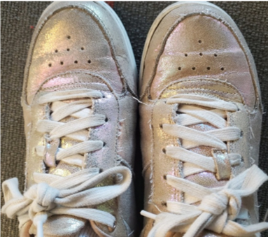 -->

	
I first met James during Bootcamp. He is kind and extremely knowledgeable. His well-organized lectures and notes became a good source of reference even years later in my own research. James cares deeply about our department. As a leader in the computational biology field, he never hesitates to share his advice on experimental design and data analysis. I'm very grateful for James' input in my project and deeply saddened by his passing. He will live in my heart for a very long time.

	
<b>—Xiuqi Chen</b>

	
James was a great teacher who made complex ideas seem simple. I still remember his lectures on constructing phylogenetic trees and his diagrams which clarified the concepts. We have lost a great teacher, RIP.

	
<b>—Nanda Rajasekaran</b>

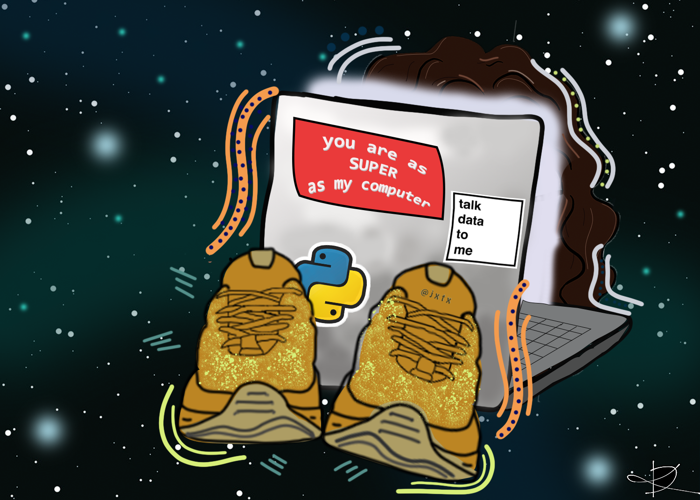

<b>Artwork by Darby Kozan</b>

<!--  -->

	
I always heard stories about James Taylor, the infamous professor that was tasked with teaching all the biology Ph.D. students how to code. When I started the program, I realized James’ class would mean I’d have no choice but to give up all my Friday nights. Even though his class would end at 5pm, I would be so absorbed with the problems he assigned that I couldn’t stop coding until I finished everything. I quickly realized that he wasn’t just teaching us how to code, but rather he was teaching us how to decode biology. It’s unbearably tough to think that the next group of students won’t get the same experience. I find solace by knowing that he will live on through the countless decoding sessions myself and others will have.

	
<b>—Justin Gray</b>

	
RIP to a Real One.

	
<b>—Ikenna Okafor</b>

	
09/06/2014 - Dr. James Taylor and I realized we had a mutual love for the Canadian show Trailer Park Boys at a happy hour post-bootcamp during my first week of grad school. His first email to me was to let me know the new season of TPB was on netflix. Will miss him greatly.

	
<b>—Diego Rivera Gelsinger</b>

	
Deeply saddened at the loss of James Taylor. I remember first reaching out to James at the start of my PhD. I had the great pleasure of rotating in his lab, which not only helped me develop my bioinformatic skills, but also ultimately set me on my career trajectory. I owe a lot to James. In addition to happily agreeing to be on my thesis committee he was an immense source of knowledge and an overall great colleague. I’m grateful for having had the opportunity to work with him. James - you will be missed dearly.

	
<b>—Brendan Miller</b>

	
I want to give my sincerest condolences to the Taylor family and friends for their tragic loss. James was an amazing teacher and mentor for grad students in our department. To be honest I did not know if I could learn about computational biology, but through his classes and projects, I've learned so much more than I could have ever imagined. You can see how much impact James had on the entire CMDB department, with his cameos in our yearly grad retreat skits, to our computational bootcamps. I know James' generosity and kindness will not be forgotten, and the amazing people he has mentored and the department will carry his legacy forever. Rest in peace James

	
<b>—Jimmy Liu</b>

	
James is a great teacher with intelligence, patience, and enthusiasm. The bioinformatic skills taught by him will always be together with my scientific adventure.

	
<b>—Haolong Zhu</b>

	
Without James Taylor I would never have been able to analyze sequencing data on my own. His learn-by-doing approach to mentoring students made learning how to code gave me the courage to try difficult things I was too afraid to do. In addition, he was always generous with his time and expertise to any student or faculty. He always fostered a friendly and approachable atmosphere in his lab. I would spend hours with his lab members troubleshooting my code and asking hundreds of questions. I will deeply miss his presence here at Hopkins.

	
<b>—Charlotte Choi</b>

	
James was an exceptional teacher. Throughout most of my education, teachers would simply state information and expect that we absorb/recall it by the next exam. Whenever I was in his classroom, that factory feeling slipped away. James walked with us through his ideas. His lectures were more like a conversation, our thoughts and ideas were part of the discourse. Everything he did, he did it to empower us. From implementing our 1 week intensive bootcamp so that coding can be accesible to all incoming graduate students, to the little things, like the way he graded our exams to test us not on the "right answer" per se, but whether can we explain something confidently and logically.

	
James was a gem; he was a true teacher and mentor. His work gently reminds us all to be more open to one another, respect eachother regardless of academic status, and empower young scientists to tackle big ideas with confidence and preparedness.

	
<b>—Rebekka Paisner</b>

	
James was a brilliant, cool, kind-hearted and incredibly genuine person. His generous and collaborative spirit continues to inspire the type of cooperation that makes science joyful and rewarding. James used his considerable talents to encourage people and lift them up. The world is a better place for the life that he lived.

	
<b>—Matthew Wooten</b>

	
Although I never got to know James personally,  I was always in awe of how highly he was  thought of.  Whenever his name was mentioned there were kind words or praise that followed.  He was truly respected and genuinely liked by all.

	
<b>—Joanne Hall</b>

	
I was really lucky to get to work with James at multiple points throughout my PhD. He joined the department during my first year, and immediately made an impact on our class by leading us in a semester-long coding course. At the time that felt a bit like a trial by fire, but looking back, it helped me build problem solving skills and gave me a basic knowledge of coding that I've been extremely grateful for both throughout my PhD and in the last year as I've moved to a job in biotech.

	
As I continued through my PhD, James was more than willing to share his time and expertise whenever I needed computational biology or coding help. At one point, I did an RNA sequencing project. When we got the data back, I didn't have a clue how to analyze it in any useful way. James took time out of his extremely busy schedule to sit down in a room with me for two days straight, talking me through all the steps of RNA seq analysis. 

	
Closer to the end of my PhD, as I worked on the manuscript for my paper, I bugged James VERY frequently, needing help with analyzing ChIP seq and Hi-C data. He ended up being a co-author on my paper, and I could not have asked for a more helpful, patient collaborator. As a member of the Johnston lab, there were many times that Bob and I would burst into his office unannounced with that day's new hypothesis or question about data interpretation. Many people would have been irritated about the frequent knocks on their office door, but James was always happy to sit down and talk science. 

	
I can remember many times that I entered James's office freaking out internally that I would never be able to interpret my data, or that I had disproven my own thesis. I never felt that way after talking to him. Partly this was because he almost always knew the answers to my questions and could point me in the right direction, and partly it was because he had a very calming personality. It was hard to be worked up or stressed out after interacting with James. 

	
A random, silly story comes to mind about one time Bob and I went over to James's office. James got up to draw something on the white board, and grabbed a green marker. He wrote with it, then realized he couldn't see what it said since he was colorblind. He then went through all the markers he had, and donated at least 5-10 green dry erase markers to our lab. We used to joke that the Johnston lab studied cone development so we could solve James's colorblindness.

	
Long story short, James was not only a brilliant scientist, but an amazing human being. I owe him a ton, and wish I had had more of an opportunity to thank him and tell him how much all his help meant to me. Without him, I wouldn't have a first author paper, any knowledge of computational biology, or a respect for sparkly gold sneakers. I'll really miss him, and I know the rest of the CDMB program will too.

	
<b>—Kayla Viets</b>

	
An important part for the start of grad school for me was the bootcamp put on by James. It helped unify our cohort's bond through learning an unfamiliar skillset together. Not only that, but James' love for the subject and genuine passion for the topic motivated me to explore new avenues of research. His contributions to the scientific field were an inspiration, and I'll miss seeing him around, occasionally on his skateboard.

	
<b>—Daria Naumova</b>

	
James is not only a great teacher but also a caring individual, who would help out the students at times when they need guidance and empathy the most.

	
<b>—Wayne Fu</b>

	
“You tell me. What do you want to know?”

	
He wasn’t a lecturer, he was a conversationalist. James was able to command the attention of a room with only his presence. Sitting side-by-side with his students, James was able to teach us the ins and outs of computational biology (even to those of us who were computationally challenged). Every CMDB student is privileged to have been taught how to navigate bioinformatics by someone as truly remarkable as James.

	
I will remember James as the incredibly talented and passionate scientist that he was. I will also remember his incredible style, complete with long, flowing hair and an ever changing collection of unique shoes. He put so much into the department, including starting the computational biology program, participating in recruitment, and always performing in the faculty skit at retreat. His presence will be missed. The world has lost a great person, but his memory will live on through those he has impacted forever. 

	
<b>—Emily Zion</b>

	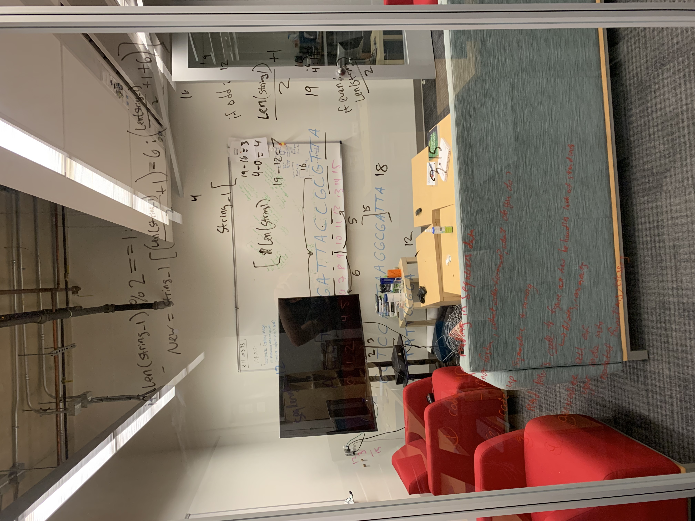
	
I took this picture one night during my fall rotation in James’ lab.  I wanted to keep a record of the mental exercise Kate Weaver encouraged me to do to help me understand a problem in my code.  James instilled a culture of camaraderie in his lab that has stayed with me, and I hope to pass on this generosity to future mentors and peers.

	
<b>—Justin Mirazee</b>

	
James was one of the best teachers in our department, and also a cool and kind person. His efforts on reasearch and teaching made a great difference to the department and inspired all CMDB students. I will miss him.

	
<b>—Simon Zhang</b>

	
I will always remember James as a wonderful teacher. His openness to collaborate and innovate, with insistence on data reproducibility and transparency was a quality that he lived, and taught. The quantitative biology bootcamp, that he led with a gentle smile and quiet enthusiasm, showed me never to be fearful of big data, and, instead, harness the power of bioinformatics to answer questions in Biology. Thank you James, for addressing all our queries patiently, and more so, for truly teaching us to teach ourselves.

	
<b>—Himani Galagali</b>

	
James Taylor wasn’t my PI but he meant a lot to me and the Johnston lab. Knowing absolutely nothing about computational biology, I chose to do a rotation with him his first year at Hopkins. Nothing was set up, and I sat in an office next to his because his lab space wasn’t ready. This was before his infamous computational biology bootcamp, so I badgered him endlessly with questions, worrying the whole time that he must think I’m really annoying. And maybe he did! But it never stopped him from helping me when I needed it; he was always patient, kind, and generous with his time. Despite knowing very little about computational biology at the start, I left that rotation with data that would later become a critical part of my eLife paper. In fact, that entire paper was predicated on the findings James helped me to discover.

	
James’ support started during my rotation but truly had no end. Throughout my years at Hopkins, Bob Johnston and I would often run up to the third floor to get his thoughts, advice, opinions, and ideas, and he always welcomed us into his office with enthusiasm. His scientific expertise was unparalleled in our department, and he contributed unique and valuable perspectives to our work. He was also a God-sent calm and collected voice of reason when Bob and I were freaking out. But beyond that, he was an incredible teacher. Later in grad school, a few lab-mates and I needed to analyze some RNA-seq data. He could have done it for us, but he wanted us to learn it. So, he took several days out of his busy schedule to run a mini workshop with us- a true testament to his immense generosity.

	
James was more than just a collaborator to me though, he was also my cheerleader. That may sound strange given that James was a soft-spoken guy, but it’s true. He didn’t literally chant at me like Bob might, but he always seemed to know when I needed a little encouragement. When my paper got rejected, he was there shaking his head, agreeing with me that it was BS and unfair. When I couldn’t replicate an important experiment, he pushed me to find a workaround. When near the end of my grad school experience I felt I had not accomplished as much as my peers, he gave me the greatest gift- a compliment I will literally never forget. His encouragement empowered me in grad school and still does today. He believed in me even when I didn’t believe in myself and I will keep that with me always.

	
James Taylor wasn’t my PI, but he absolutely helped shape me into the scientist I am today and I will forever be grateful for him.

	
<b>—Caity Anderson</b>

	
I first met James at the end of August 2017.  We were the new CMDB class starting our Ph.D. training in James's Quantitative Biology Bootcamp.  What I remember about how he introduced himself to us was how he described learning biology in his Ph.D. as "reading Albert's (Molecular Biology of the Cell) from cover to cover".  It was a short introduction that was extremely humble, but I could still immediately tell that he was an incredibly brilliant guy.  James struck me as the kind of person that appears in the right place, at the right time, with the unbelievable talents and skills to change the world.  Even still, he made us all laugh during our CMDB retreat when he claimed that he "didn't understand proteins."  He was one of those people that I feel lucky to say that I knew, even just a tiny bit, even for just a short while.  He had great shoes, great hair, and it was a treat to see him cruise by on his bike or skateboard on the Maryland Avenue bike lane.

	
I greatly admired James' commitment to teaching and his desire to make computational biology accessible to as wide an audience as possible.  I'm not much of a coder, but I am much better, thanks to James.  I was very intimidated about even attempting to do a rotation in his lab, but I have such enthusiasm for his work that I couldn't pass up the chance to learn from the best.  James served on my GBO committee and was chair of my thesis committee.  One of the turning points in my GBO was James's line of questions.  My favorite moment was the look of pleasant surprise when I was able to correctly answer the approximate percentage of human genes that have a canonical TATA-box.  After a bit of a rough start, he gave me a boost of confidence to finish strong.

	
James was the kind of professor that makes you want to build something or have some idea that maybe, just maybe, he would think was cool or interesting; yet he was never stingy with a complement for good work.  He was also the sort of professor that you never wanted to disappoint; but he was not harsh with a critique and was happy to provide constructive criticism to make you better.  James had a very hands-off approach to mentoring, but he never made me feel like he didn't have time or wouldn't make time to meet with me or work through a problem.

	
I loved having the opportunity to discuss with James his visionary ideas that were ready to shape the next decade or four of computational biology.  What I wouldn't give for another chance to chat with him about the spectacular possibilities.  I think that is what I will miss most.  But I am inspired by the work that he has done, and the work he would want us to keep doing.  And I will carry James's memory and my experiences with him for the rest of my career, building things and having ideas that I would love to tell him about.

	
<b>—Michelle Biederman</b>

	
As a colleague, James would not only freely discuss ideas and give advice to graduate students, but was also fun to talk with — at happy hours, retreats or in the hallway. Once, when I brought up how the pound sign "#" is now often called a "hash-tag," James immediately quipped that, clearly, we should all refer to the symbol by its proper designation: the Octothorpe. This lighthearted response, a deadpan mix of esoteric and informative, was quintessentially James.

	
<b>—Andrew Martens</b>

	
It feels so surreal that such a valuable member of our department is gone so suddenly. I can't imagine what the department will be like upon returning to campus. Although I did not interact with or know him personally, I admired how passionately he taught lectures during biophysics and how well he articulated his lessons. I enjoyed James' little jokes here and there while he saw how much we struggled during the bootcamp; now I can't even imagine how it will be without James around to teach the bootcamp again. My favorite memories of James will always be watching him skateboard around campus in shiny, metallic shoes, and the quiet sense of humor he shared with everyone. Rest in peace, James. 

	
<b>—Amanda Ray</b>

	
James was a terrific teacher and mentor, and I am so thankful for the time I had building that relationship. The more time I spent with James, the more I saw how genuinely fun he was. This was perhaps most obvious to me at the department’s annual retreat, where students and faculty prepare and present skits about life in the program. This past year, the skits followed a Stranger Things theme, and James played Billy, a role he adopted almost seamlessly. Demonstrating his characteristic dedication, James had grown out his facial hair the days leading up to the performance so that he could shave it down to Billy’s distinctive moustache. As the villain, Billy of course has a fitting tattoo of a skull smoking a cigarette on his arm. In turn, James sported a tattoo of something equally spooky: a Hi-C interaction map. Terrifying! 

	
<b>—Dylan Taylor</b>

	
James was the one of the people in the department that my cohort ended up spending the most time with in our first year, between bootcamp, Friday quant lab, and his inaugural semester of teaching biophysics. Over the course of that year, he slowly altered the course of my PhD. I came into CMDB with almost no coding experience, and James's teaching helped me become me comfortable enough to rotate in and join a computational lab.

	
James was an amazing teacher. It must have been hard to be constantly explaining genomics to students who had no background in any quantitative field, and to be faced with our confused faces whenever he wrote anything vaguely mathematical on the board. When I half-seriously asked him whether my cohort was doing worse than his undergrad students at understanding his biophysics material, he joked that the main difference was that we complained more. But despite our complaining, he was always patient with us, welcomed our questions, and somehow managed to give all of his explanations in the clearest possible way. Whenever I think about it, I'm still amazed at how well he taught us Markov models, sequence alignment, and other complicated topics when almost none of us even knew probability. His classes were some of the highlights of my first year, and I still remember them fondly, and occasionally reference his carefully typed and LaTeX-formatted notes.

	
I remember lots of Friday afternoons in quant lab with James, when my classmates and I would struggle with the coding assignment until one of us made a breakthrough and shared it with everyone else. I remember his patient responses to the many questions we asked during lab, his quiet and approving smile in the background when we figured out how to approach a problem and then explained it to our peers, and his genuine happiness whenever we lifted our heads from the nitty-gritty of the Python grind and were excited about what we'd accomplished in class that day. I think he liked and intended that we used those labs to learn through self discovery and helping others. That approach is still my lasting impression of his teaching style: that he helped us develop the tools and knowledge we needed to solve problems on our own. His classes were never easy, and they required time and effort, but he taught them well, and we definitely learned.

	
When I was choosing a thesis lab, James made the time to listen to my concerns, give thoughtful advice, and quietly encourage me. I would run into him every now and then dropping into the lab to talk with his students, or sitting in the hallway to grind coffee (so that he wouldn't bother people in lab with the noise), or when I passed by his office on my way to the kitchen and heard a truly diverse selection of music coming from his door. I thought he would always be there, sneakers up on his desk, with his door open if I needed advice on science or grad school. I will miss him, and I'm sad to no longer have his guidance. I'm grateful that I had the opportunity to know him and be taught by him for a short time.

	
<b>—Stephanie Yan</b>

	
In my last email from James regarding some work issues he said “I’m feeling generous”.  In fact James was always generous.  He was generous with his time, his scientific expertise, and his gratitude.  He loved our department and was very grateful for the faculty, students and staff.  He had found his home. I remember working with him on his very large U54 proposal before he arrived and he was surprised and grateful that we were contacting all the subs on the proposal to alleviate the workload for him.   When I asked him to speak at the Homewood Research Administrators Day he of course accepted and during the speech expressed his gratitude for the staff in Biology as well as for all research administrators.

	
James was our “rock star” and transformed our department. For that I will be eternally grateful to him.  My deepest sympathy to Meredith, his family and all of his colleagues.

	<b>—Cindy Holstein</b>

	
James Taylor was a tremendous human. He taught me that you don’t have to stress to be a successful scientist; you can also be a calm, cool, mellow individual with shoes that brighten everyone’s day. James was a leader in what is arguably the best part of the JHU Biology department: collaboration. As part of the Johnston lab, he was a collaborator to almost every project we started.

	
Discussing science with James was always fun and enlightening. As usual, James was even keeled and cool-headed in all of these discussions, but I enjoyed the added pep in his speech and a twinkle in his eye that appeared when discussing something he was particularly excited about. What was even more special about James is that he was equally passionate about putting the tools of discovery in other people’s hands. It was evident from watching him teach that he genuinely loved sharing the secrets of using python, R, and manipulating data to ask questions and communicate answers. Our students are better because of James, our department is better because of James, and science is better because of James.

	<b>—Kiara Eldred</b>

Click <a href="https://docs.google.com/forms/d/e/1FAIpQLSdO6s-xnuFjByy3tP4AphkLBzO3ValbacWEgMZeXVMX4oSzTA/viewform?usp=sf_link">here</a> to contribute your memories of James

<header class="major">
	<h1>Photos</h1>
</header>

	<figure class = "image1">
		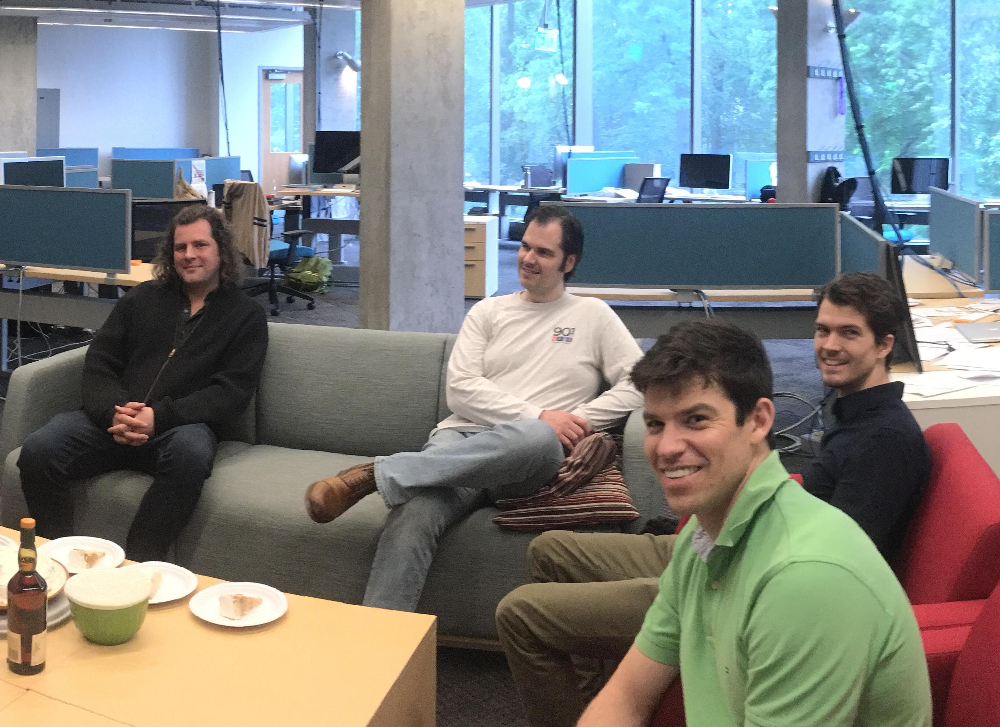
		<figcaption>James celebrating with the lab after being promoted to full professor.</figcaption>
	</figure>

	<figure>
		
			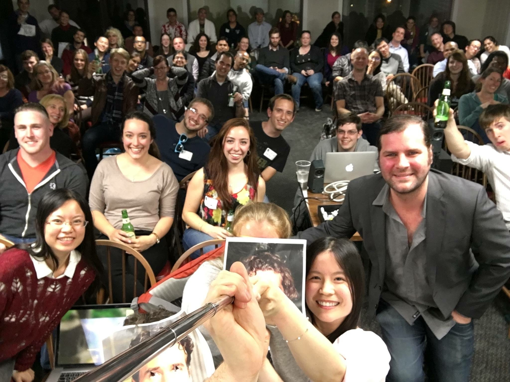
			<figcaption>CMDB Retreat, 2015.</figcaption>
		
	</figure>

	<figure class = "image4">
		
		<figcaption>Preparing for the 2015 CMDB Retreat faculty skit: ‘Mud Slinging, 2016’ about a debate among the Republican candidates for president.  James played Florida Senator ‘Marco Boobio’ (tag line: “He’s hot and he knows it.“).</figcaption>
	</figure>

	<figure class = "image2">
		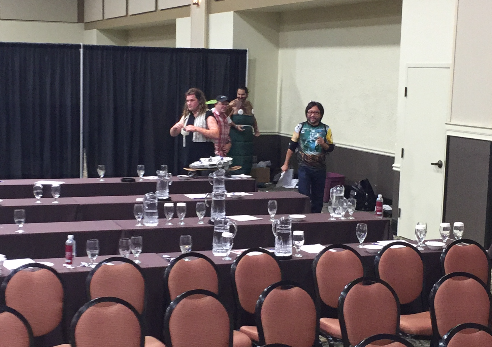
		<figcaption>Preparing for the Star Wars skit at the 2016 CMDB Retreat: James getting into character as ‘James James Binks’, Mark as ‘Yodoren,’ Samer as ‘Jabba the Hattar,’ and John as ‘Data Fett.’  Ever the consummate professional, James made a vest for his character by applying duct tape on his shirt.</figcaption>
	</figure>

	<figure class = "image3">
		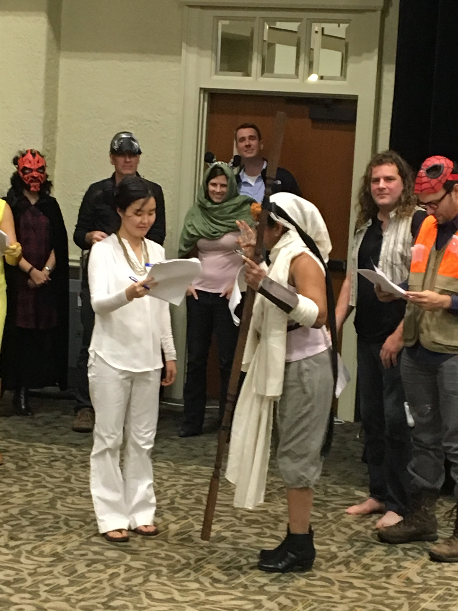
		<figcaption>Rehearsing the Star Wars skit, CMDB Retreat 2016.</figcaption>
	</figure>

	<figure class = "image3">
		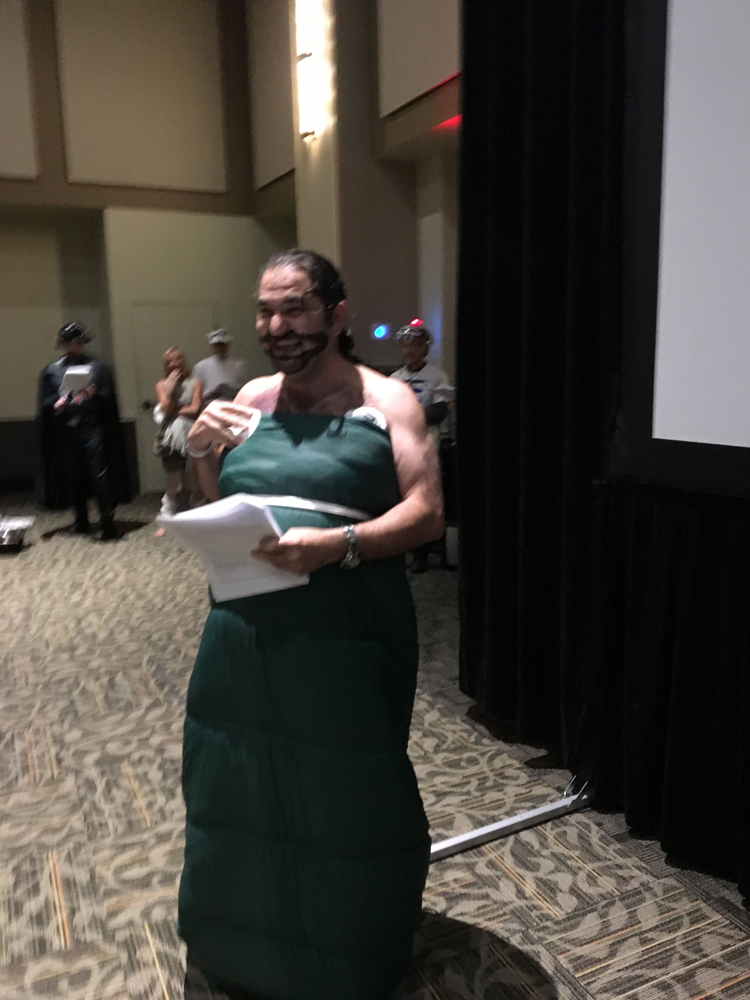
		<figcaption>When James first saw Samer in character as ‘Jabba the Hattar,’ he wanted to run away.  Star Wars skit, CMDB Retreat, 2016.</figcaption>
	</figure>

	<figure class = "image1">
		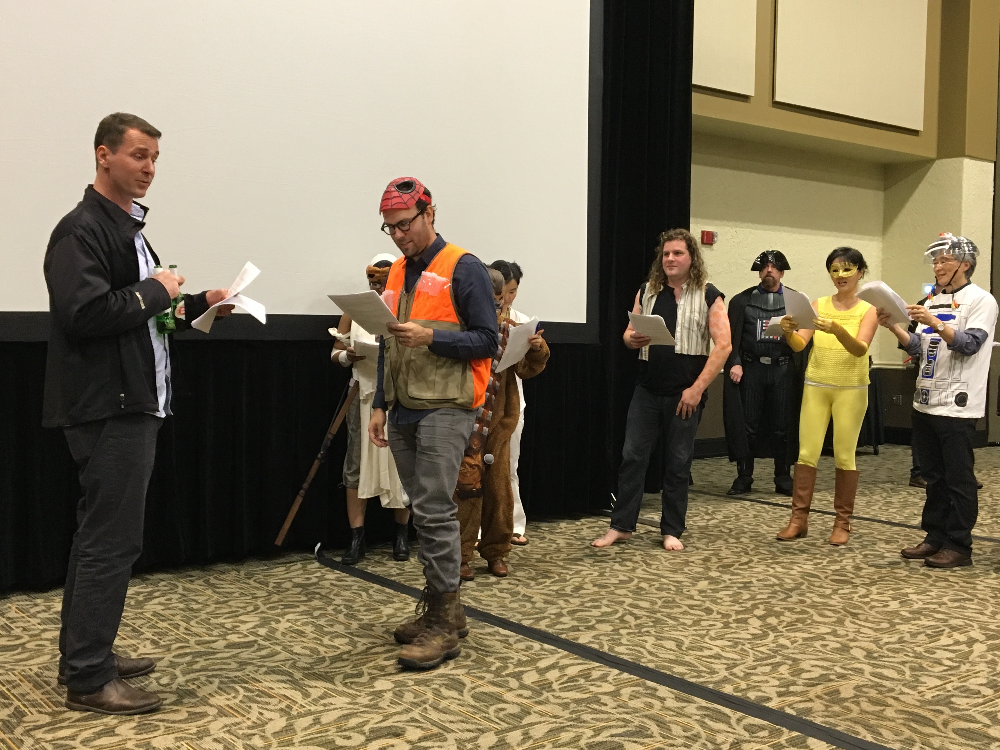
		<figcaption>Rehearsing the Star Wars faculty skit at the 2016 CMDB Retreat.  James drew spots all over his arms to get into the character of ‘James James Binks.’</figcaption>
	</figure>

	<figure class = "image2">
		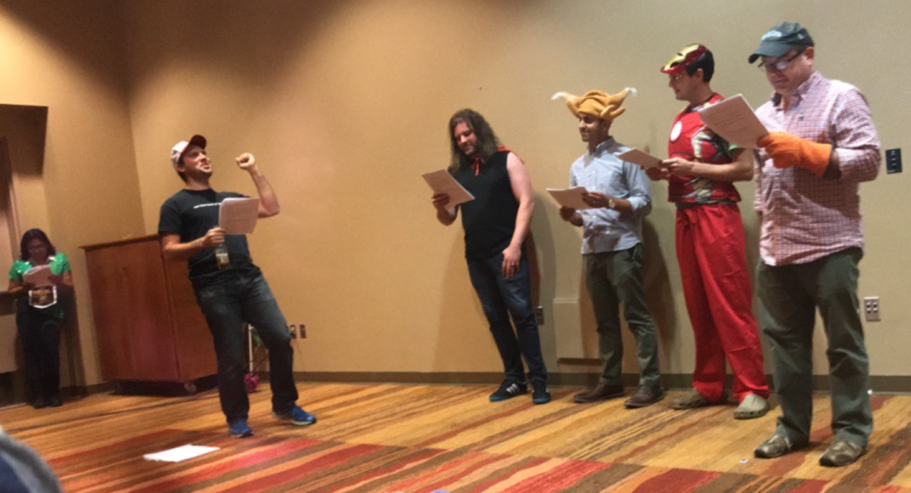
		<figcaption>The faculty skit at the 2018 CMDB retreat. James was playing Thor.</figcaption>
	</figure>

	<figure class = "image5">
		
		<figcaption>James receives the 2019 Graduate Teaching Award during our CMDB graduation ceremony.</figcaption>
	</figure>

If you have photos of James you'd like to be featured here please send them to <a href = "mailto: jxtx.bio.memorial@gmail.com">jxtx.bio.memorial@gmail.com</a>

</section>

