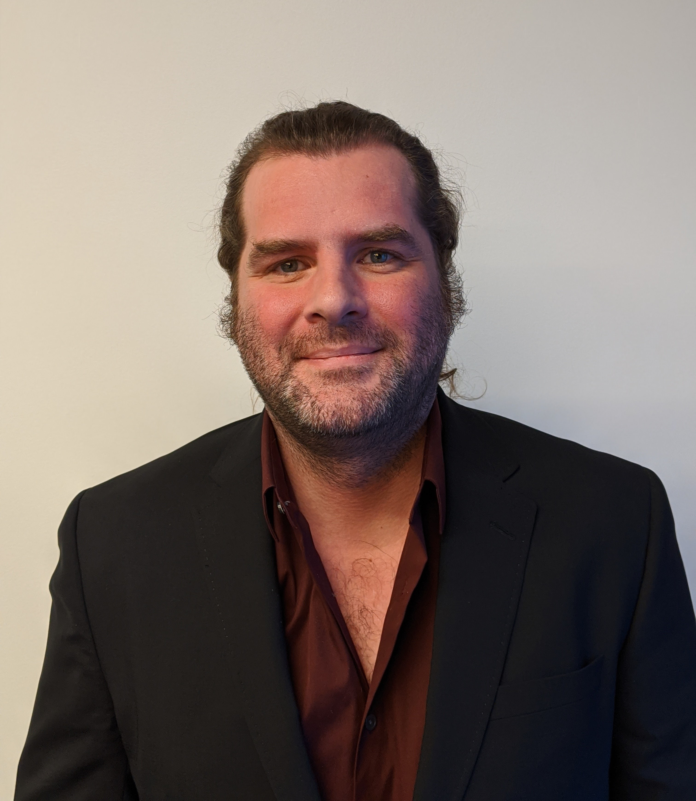

<head>
</head>

    <section id="one">
        

            <header class="major">
                <h1>Obituaries</h1>
            </header>
    <h2 id="content">Title pending</h2>
    
    
<b>James Taylor</b> (1979-2020) was an iconic professor in the CMDB department known for his eclectic taste in music, noteworthy shoes, wheeled-transportation, chill demeanor, dedicated skit performances, solid food recommendations, and especially his ardent support of his students and colleagues.

    
James was a pioneer in integrating biology and computer science throughout his training and career. He attended the University of Vermont, earning his B.S. in Computer Science in 2000. After working in industry for several years, he began his Ph.D. studies in the Center for Comparative Genomics and Bioinformatics at the Pennsylvania State University under the mentorship of Webb Miller and Francesca Chiaromonte. By encoding multi-species alignments and incorporating computational clustering, search, and learning algorithms, he identified novel regulatory regions in the genome that were frequently validated by subsequent studies. At Penn State, James worked with Anton Nekrutenko and others to start the <a href="https://galaxyproject.org/jxtx/">Galaxy project</a>, an online platform for open and reproducible data analysis. After finishing his Ph.D. in three years, he continued on to New York University where, as a visiting member of the Courant Institute for Mathematical Sciences, he continued developing Galaxy further. 

    
James established his lab at Emory University in the Departments of Biology and Mathematics & Computer Science in 2008. He continued as a lead of the Galaxy project and worked to understand the 3D organization of the genome and gene regulation. In 2013, he was promoted to Associate Professor with tenure. Moving to Johns Hopkins University in 2014, James was named the Ralph S. O’Connor Professor of Biology and Computer Science and was promoted to Professor in 2018. While at JHU, James was a PI for AnVIL, a large NIH initiative to provide genomic researchers with cloud-based resources for genomic data access, sharing and computing. In addition to Galaxy, AnVIL, and JHU collaborations, James provided his expertise to numerous committees, advisory boards, and consortiums throughout the field to advance scientific knowledge and reproducibility.

    
A cornerstone of the CMDB community, James was an integral member of the department’s recruitment, hiring, and thesis committees, involved in numerous collaborations, and a fantastic instructor who shared his love of computational biology and dedication to reproducible science with all new trainees. Upon joining the faculty in 2014, he created and led a summer bootcamp and weekly lab course within the graduate curriculum to teach students computational biology and open, reproducible data analysis. The course served as many of these students’ first introduction to coding, and James received an Excellence in Graduate Teaching award in 2019 to honor his work on it.

    
Aside from his formal responsibilities, James excitedly discussed science, experimental design (including the need for many replicates), and ways to improve teaching with many in the department. He welcomed high school and undergrad summer students into his lab with the purpose of teaching them coding and exciting them about science, and made an effort to advocate for under-represented minorities and women in STEM whenever possible. Finally, as a mentor, James supported a vibrant and unconventional community of <a href="https://taylorlab.org/">Galaxy and research personnel in his lab</a>, enabling each member to thrive by providing space to try things and confidence in his students’ abilities. He treated each member as a colleague and offered encouragement in the face of difficulties and celebration of even minor successes. James did not self-promote, but he continuously promoted and supported future scientists, his colleagues, and his students.

    
As a close, here is some quintessential advice and words of wisdom from James:

        <ul>
        <li>Simplicity in all things.</li>
        <li>Go back to the data.</li>
        <li>Inbreeding is great! . . . Wait. Please quote me in context.*</li>
        <li>Good ideas don’t have owners—they belong to everyone.</li>
        <li>Try it first and see.</li>
        <li>You’re not ‘guessing’. That’s a nasty word. You’re inferring in a completely rigorous way.</li>
        <li>Hope!</li>
        </ul>
    
*With regards to this quote, at the time, James did ask to be quoted in context, so here it is. In the Spring 2019 Quantitative Biology and Biophysics course (which James organized and taught several lectures for), he asked for examples which would cause a population to have less than complete gene flow. A student answered with inbreeding, and in classic James excitement, his response created a lasting memory for the 2018 cohort.

    
<b>Obituary written by James' student, Kate Weaver</b>

    <h2 id="content">In Memory of James Taylor: The birth of Galaxy</h2>
    
James Peter Taylor, the Ralph S. O’Connor Professor of Biology and Computer Science at
        Johns Hopkins University (JHU), passed away on April 2, 2020. He was 40 years old. James
        was an exceptional scientist, colleague, mentor, and community builder, who worked at the
        intersection of biology and computer science. His life's pursuit was to understand how genomic
        and epigenomic information is processed during normal development and dysregulated in
        disease. As co-leader of the Galaxy ( <a href="http://galaxyproject.org ">http://galaxyproject.org</a> ) and AnVIL
        ( <a href="http://anvilproject.org">http://anvilproject.org</a> ) projects, a major thrust of James' career aimed to support the work of
        others, especially to empower those with limited resources. His impact was broad, as
        innumerable scientists worldwide benefited from his leadership, mentoring, and scientific
        contributions.

    
James completed a B.S. in Computer Science (Magna Cum Laude) at the University of Vermont
        in 2000. After spending three years as a senior software engineer in Vermont, he joined the
        Ph.D. program in Computer Science at the Pennsylvania State University in the Center for
        Comparative Genomics and Bioinformatics under the supervision of Professors Webb Miller and
        Francesca Chiaromonte. His Ph.D. work focused on developing novel machine learning
        approaches for identifying functional elements in the genome, leveraging the wealth of new
        data from ENCODE ( <a href="https://www.encodeproject.org/">https://www.encodeproject.org/</a> ) and the alignments of newly assembled
        vertebrate genomes.

    <h4>Creating a Galaxy</h4>
    
During this time at Penn State, James worked closely with me (Anton Nekrutenko) and others to
        start the Galaxy project, a comprehensive web platform for open and reproducible
        computational data analysis. The first software commit to the project repository was on June 1st,
        2005 by James. Today, Galaxy needs no introduction to anyone working in genomics, but at the
        time was a major advance above the ad-hoc command line bioinformatics analysis that
        dominated the field. The initial version introduced support for accessing remote data resources
        and visualizing the results. The project grew to incorporate thousands of analysis tools into
        one unified graphical user interface, accessible to anyone via a web browser. The Galaxy
        project remains a landmark achievement and has forever changed the way scientists analyze
        and share data.

    
After completing his Ph.D. in 2006, James worked for two years as a visiting member of the
        Courant Institute for Mathematical Sciences at New York University. During these two years,
        Galaxy became one of his principal projects as James coded several of its iconic features,
        including the three-pane interface, the “noodly” workflow editor, and the dynamic genome
        browser Trackster. In 2008, James started his laboratory at Emory University in the Department
        of Biology and the Department of Mathematics & Computer Science. He was promoted to
        Associate Professor with tenure in 2013, shortly before his move to JHU where he was
        promoted to Professor in 2018.

    
It was at Emory University, and later JHU, where the Galaxy platform exploded in popularity,
        driven by the growth of high throughput sequencing data and large-scale cloud computing. This
        combination of technologies has proven to be transformative to the field, and the Galaxy project
        has reached a wide audience of scientists evidenced by thousands of citations. Today
        thousands of scientists around the world use Galaxy daily.

    
The Galaxy Project is not only a software platform but also a scientific community. James’
        dedication to accessible, reproducible, and transparent research promoted a community of
        researchers that extended far beyond the original development team. Scientists, often working
        completely independently from the founders, have taken Galaxy into entire new research
        domains. The strength of the Galaxy community is also seen every year at the community-run
        conference that brings hundreds of participants together to share their latest contributions and
        applications.

    
James was an ardent and principled advocate for open science, especially open access to
        scientific data and open-source software. James said that software may come and go, including
        even Galaxy, but the metadata that Galaxy collects will ultimately be his most valuable
        contribution to science. This metadata enables anyone to observe all analysis steps and
        reproduce entire analyses, providing the bedrock for future discoveries. Without such
        transparency and rigor, he explained, the entire field will suffer.

    <h4>Beyond the Galaxy</h4>
    
While James is widely known for his development of the Galaxy Project, he made numerous
        other contributions to science and education. James collaborated with many experimentalists to
        analyze Hi-C data and interrogate the 3D organization of the genome. At Emory, James worked
        to understand how DNA binding proteins shape nuclear architecture as cell fates are specified.
        At JHU, James collaborated to decipher the mechanisms of the mysterious “A” and “B”
        compartmentalization of the genome in relation to the nuclear lamina. He applied his
        knowledge of the genome to identify “buttons” that promote gene regulation between
        chromosomes. James’ curiosity and collegiality led to new scientific directions as he
        evaluated ribosome profiling data to identify A and P sites, analyzed long-read transcriptome
        data to characterize development in worms, and interpreted transcriptome data from human
        retinal organoids to understand how our eyes develop, among many other projects. No
        matter the question, approach, or organism posed to him, James was always up for a new
        scientific challenge.

    
James’ love of science was matched by his passion for teaching. At JHU, he completely
        transformed and revitalized the curriculum within the graduate biology program to require
        training in computational and quantitative research for all Ph.D. students. This was rooted in his
        recognition that all subfields of biology are increasingly data-rich and quantitative. For many of
        the students, James’ ‘boot camp’ was their first introduction to such techniques; as with a
        military boot camp, the students were left mentally and physically exhausted at the end of the
        day. Ultimately, however, they all appreciated how it made them stronger and more empowered
        scientists. James’ passion for teaching extended to the annual Computational Genomics course
        at Cold Spring Harbor Laboratory that he co-taught with David Hawkins and William Pearson.

    
Galaxy, and every aspect of James’ life, benefited tremendously from James’ leadership style.
        Rather than an authoritarian top-down approach, he led by example, contributing code and
        technical oversight with exceptional mastery and precision. While he generally had a laid back
        personality, he was always willing to fight for his students, friends, and colleagues. Whenever I
        (Schatz) felt stuck about a particular administrative or logistical issue, James fired back about
        how the university administration should support us even more. I also knew that whenever I was
        not in the room, he would be there to advocate for me on my behalf. He offered these gifts to
        everyone, which promoted deep friendships and community for all of us around him.

    <h4>Thank you James</h4>
    
James was always kind, friendly, and generous, and we will miss him dearly. He is survived by
        his wife Meredith Greif, a sociology professor also at Johns Hopkins. We all will strive to carry
        on his vision in his absence.

    
If we could talk with him one last time, we would say: Thank you, James, on behalf of your
        community, for being a friend, a leader, a colleague, a mentor, a student, a scientist, a
        programmer, and an advocate. Thank you for embracing your bioinformatics community and
        sharing resources in the spirit of accessibility and scientific progress. Thank you for sharing your
        strengths in selfless ways, for dedicating your life’s work to further scientific research in
        genomics and beyond. Thank you for caring, participating, and leading the way. You leave
        behind many teams and communities, many people who worked on the things that you started,
        many who thought that they would have more time to work with you on projects and reach new
        scientific heights. Please know that we will go forward and continue what you started, keeping
        you close, building on your work, and expanding on the many foundations that you provided.
        We will try to be better friends, leaders, colleagues, mentors, students, scientists, and
        advocates for each other, because we know, through your work and your many examples, that
        this is what you wanted us to do.

    <h4>Acknowledgements</h4>
    
We would like to thank Alexis Battle, Jeremy Goecks, Robert Johnston, Ben Langmead, Jeff
        Leek, Rajiv McCoy, Kelly Moffat, and the Galaxy team for their careful edits and suggestions.
        We would also like to thank the entire bioinformatics community for their outpouring of support.

    
<b>Obituary written by James' colleagues, Anton Nekrutenko and Michael C. Schatz</b>

</section>

